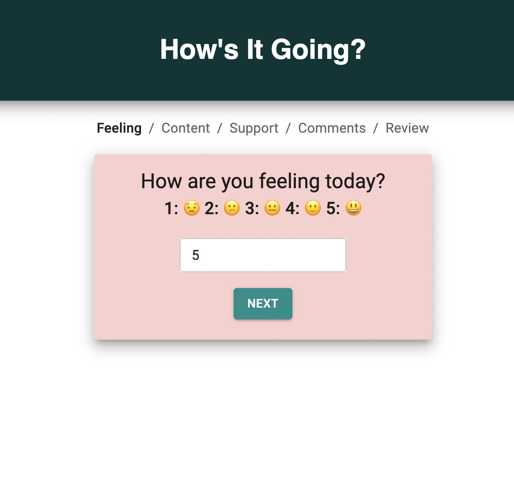
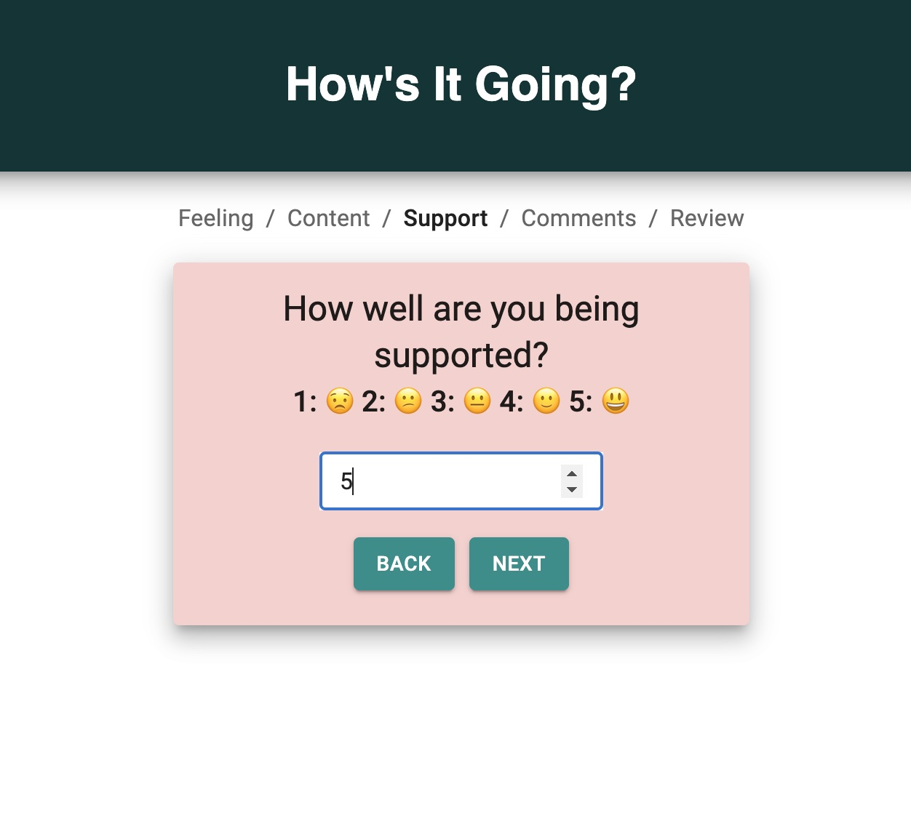
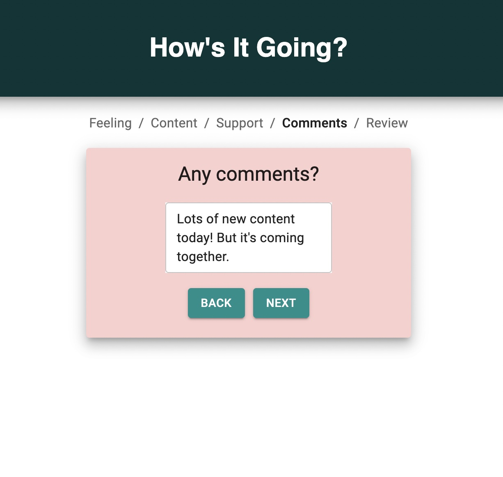
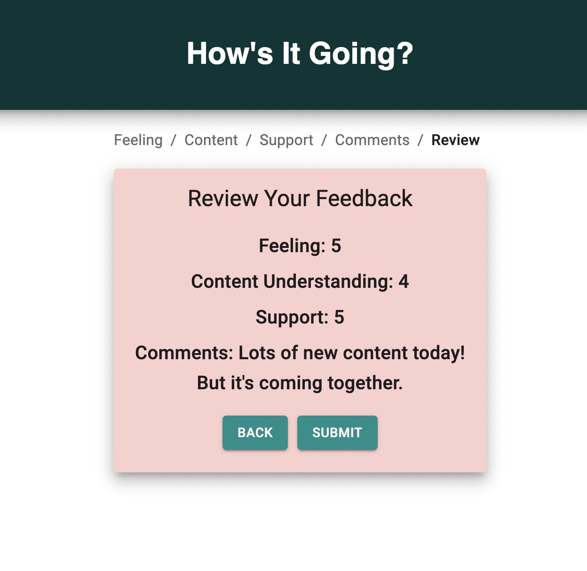
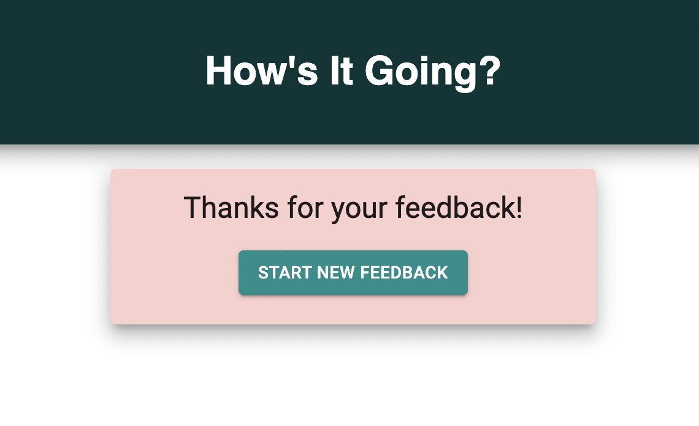

# How's It Going?

## Description

_Duration: 1.5 weeks_

When teaching or learning a new skill or subject, checking in regularly for feedback is important! How's It Going is a simple, to-the-point application that gauges how a student is doing.

The user is asked to rate the following on a scale of 1 - 5:

- How they are feeling that day
- How well they understand the content
- How well they are being supported

The user is also provided with a page for any additional comments they want to pass along.

Finally, the user reviews their feedback and submits!

After a successful submission, the user sees a submission-success page and the option to start a new feedback form.

To see the fully functional site, please visit: [How's It Going?](https://shielded-shelf-86602.herokuapp.com/#/)

## Screen Shots

### Prerequisites

- [Node.js](https://nodejs.org/en/)
- [nodemon](https://nodemon.io/)
- [Postgres](https://www.postgresql.org/download/)

## Installation

1. Create a database named `prime_feedback`.
2. The queries in the `data.sql` file are set up to create the necessary table and an example feedback submission. The project is built on [Postgres](https://www.postgresql.org/download/), so you will need to make sure to have that installed. I recommend using [Postico](https://eggerapps.at/postico/) to run those queries as that was used to create the queries.
3. Open up your editor of choice and run an `npm install`.
4. Run `npm run server` in your terminal.
5. Run `npm run client` in your terminal.
6. The `npm run client` command will open up a new browser tab for you!

## Usage

The process of learning something new can be exciting and overwhelming, some days it clicks and some days it really doesn't, and having good support is critical! How's It Going provides a platform for tracking the whole experience!

Whether you're a teacher who wants feedback from your students, or you're going the self-taught route and want to reflect on how things are going, this platform will add value to your day. 

You can rate how you're feeling, understanding content, and being supported, as well as leave comments. You'll be asked to review your entries and can always go back to edit before submitting!

## Built With

- [Node.js](https://nodejs.org/en/)
- [nodemon](https://nodemon.io/)
- [Express](https://expressjs.com/)
- [React](https://reactjs.org/)
- [Redux](https://redux.js.org/)
- [Postgres](https://www.postgresql.org/download/)
- [Material UI](https://mui.com/)
- JavaScript
- CSS
- HTML

